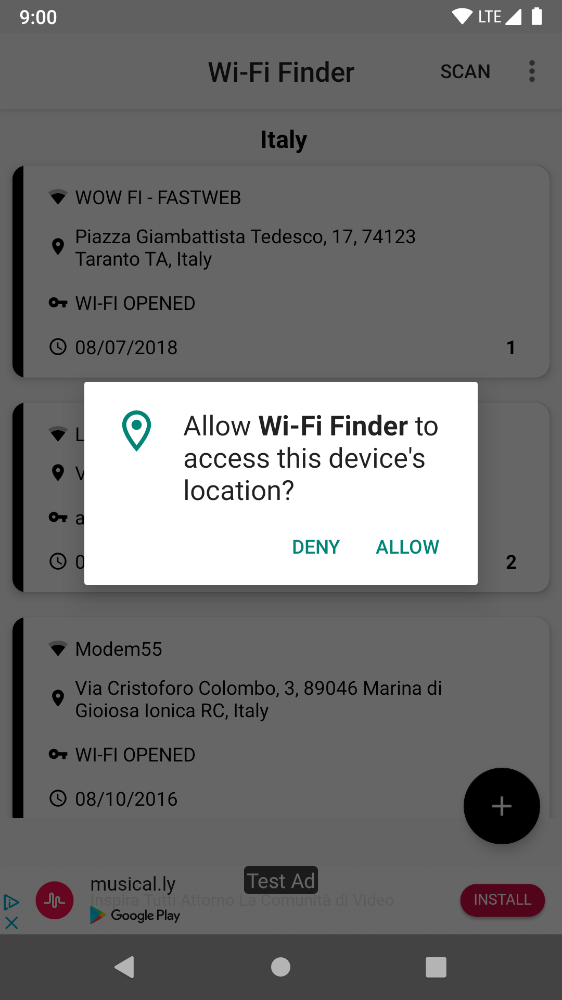
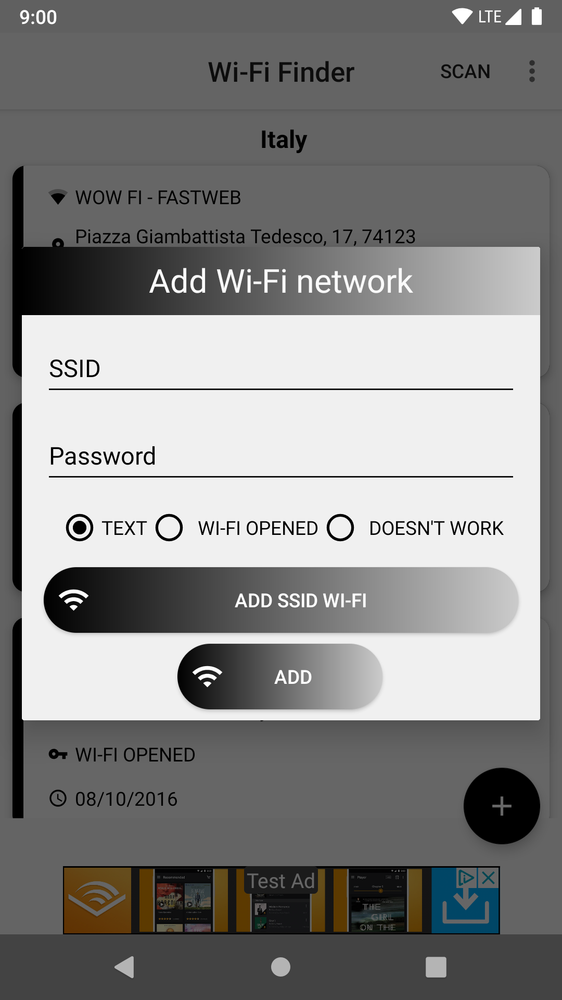
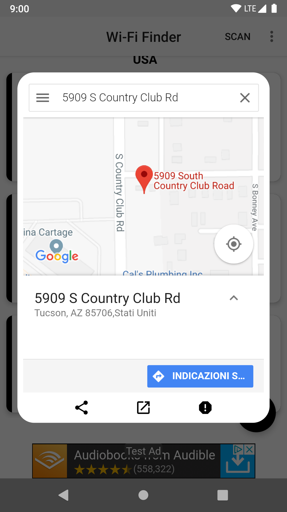

# Wi-Fi Finder
App android per la visualizzazione delle reti Wi-Fi in base alla tua posizione

## Download
  

## Licenza
Con licenza GPLv3: http://www.gnu.org/licenses/gpl-3.0.html

## Screenshots

<!-- Markdown link & img dfn's -->
[travis-image]: https://travis-ci.org/Fast0n/WifiView.svg?branch=master
[travis-url]: https://travis-ci.org/Fast0n/WifiView

[version-image]: https://img.shields.io/github/release/fast0n/WifiView.svg?style=flat-square
[version-url]: https://github.com/fast0n/WifiView/releases/latest

# Dona per il progetto
Per la creazione di questo progetto è stato investito del tempo, se ritieni che sia utile dona allo sviluppatore.

